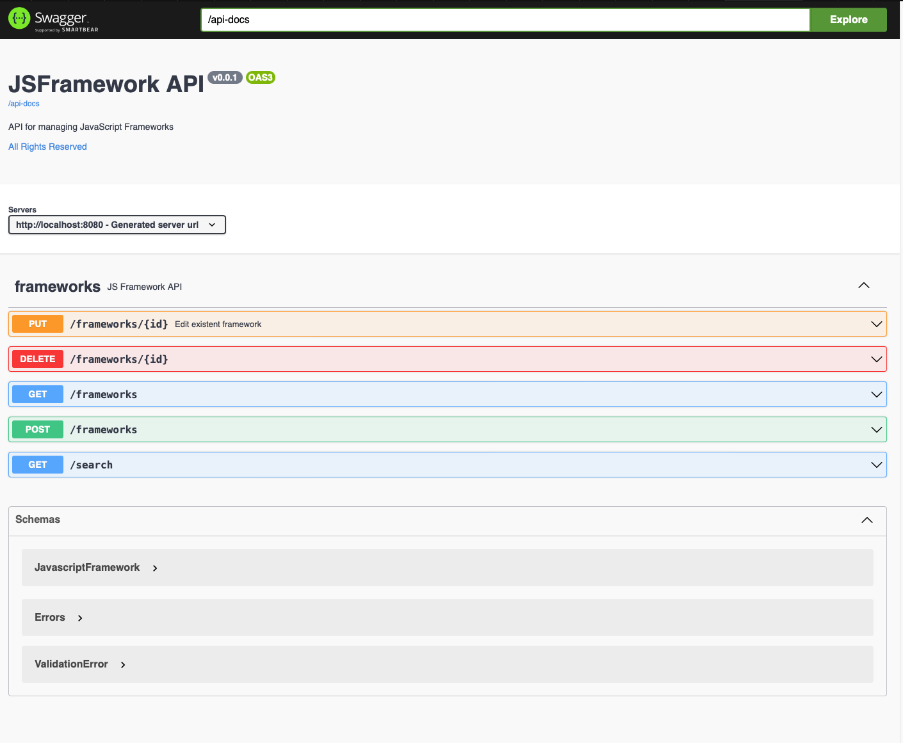

# Project Information

App to manage JS Frameworks.

### How To Run Application

`gradle bootRun`  
runs on port : `8080`

### Api Docs

may be found on:

* swagger ui `/api-docs-ui.html`
* open api `/api-docs`

